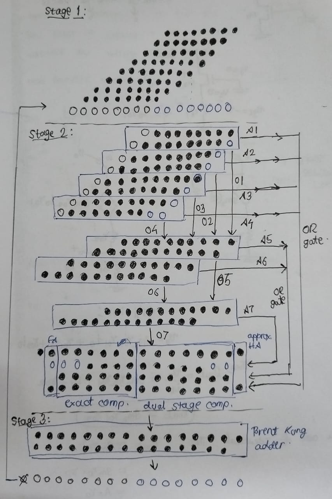

# Approx_MAC
Design and Evaluation of Low Power MAC for ML Applications

This design is of an approximate multiply-and-accumulate (MAC) unit. 
The MAC partial product terms are condensed through the utilization of basic AND-OR gates as approximate counters and the recovery module is also added to improve the accuracy.
It uses 8-bit multiplier with the accumulation of 3 stages, and is being carried out using Verilog HDL along with the simulation.
The proposed approximate MAC is then compared against existing approximate MAC and exact MAC to evaluate its energy efficiency.

Here's my design for approximate MAC

